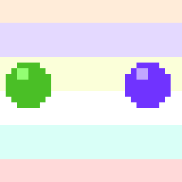

# Raster.js

raster.js is a retro graphics framework

It lets you create graphics that imitate vintage computers and ancient game hardware, using javascript. It is great for making pixel art, exploring 2d demo effects, and creative coding.

It aims to serve as a tool for prototyping, experimentation, and learning about how old school graphics worked. It provides precise pixel control, and portability across multiple javascript environments and rendering contexts.

# Features

* Pixel based, hard edges, no anti-aliasing
* Limited 8-bit palette, default 64 colors, expandable to 256
* Runs in multiple places: in browser using webgl, in node.js using SDL, on raspberry pi using dispmanx
* Easy utilities for saving gifs and pngs
* Colors presets for machines such as the NES, ZX Spectrum, Pico-8, Gameboy, DOS, and more
* Features that imitate ancient hardware such as color attributes and rasterization interrupts
* Ability to recreate classic effects like parallax and palette cycling using programming interfaces similar to what was used back in the day

# Example Usage

```
const ra = require('raster');

ra.setSize(32, 32);
ra.setZoom(8);
ra.setSlowdown(5);
ra.palette.setEntries([0, 1, 2, 3, 4, 5, 27, 43, 38, 54]);

// create 3 fields to use for sprite character data
ra.spritelist.createChar({num: 3, x: 10, y: 10}, (field, i)=>{
  field.setColor(6);
  field.fillCircle({centerX: 5, centerY: 5, r: i + 3});
  field.setColor(7);
  field.fillSquare({x: 4 - i, y: 3 - i, size: i + 1});
});

// make a background using a few rectangles
for (let i = 0; i < 6; i++) {
  ra.setColor(i);
  ra.fillRect({x: 0, y: i*6 - 2, w: 32, h: 8});
}

function draw() {
  // move two spheres
  for (let i = 0; i < 2; i++) {
    // pick which z-layer, and which character graphic to use for the sprite
    let z = (ra.theta < 0.5) ? i : 1 - i;
    let c = Math.abs((ra.theta % 0.5) - 0.25) >= 0.19 ? 1 : (1 - z) * 2;

    // move in a circular motion around each other
    let x = 0.5 + ra.oscil({max: 21, phase: i/2});
    let y = 7.5 + ra.oscil({max:  6, phase: i/2 + 0.25});

    ra.spritelist.set(z, {x: x, y: y, c: c, p: i*2});
  }

  // cycle the background colors by changing entries 0..6
  let bg = [57, 62, 58, 7, 60, 56, 59, 63, 61];
  ra.palette.cycle({values: bg, endIndex: 6, tick: ra.tick * 0.45});
}

ra.run(draw);
```



# Installing

You can use raster.js either in the browser using canvas, or on the command-line using node.js (graphics will appear in a new SDL window).

### Browser

Either grab `raster.min.js` from the latest release, or clone this repo and run:

```
npm run build
```

which outputs `dist/raster.min.js`

You can also create a development build (less efficient, but better for debugging) by running:

```
npm run dev
```

### Webpack

See [this example](src/contrib/example-web/) for how to build a web app using raster.js with webpack.

### Node.js with SDL

Installing raster.js for use with node.js requires setting up an environment that can build native add-ons. This means you need to install Python and a C++ compiler, see [the node-gyp instructions for your operating system](https://github.com/nodejs/node-gyp#installation).

Using SDL requires the installing the SDL2 development libraries. See below for platform specific details. Once you have them properly setup, run

```
npm install raster
```

### SDL2, macos

On macos, run `brew install sdl2` to get SDL2.

### SDL2, Windows

For Windows, it is recommended to use [msys2](https://www.msys2.org/), but Powershell and WSL will probably work too. Grab the latest [SDL release](https://github.com/libsdl-org/SDL/releases) and get `SDL2-devel-<version>-mingw.zip`. Extract this zip to get the `SDL2-<version>` folder and place it within the directory `c:/SDL/`, so that it ends up at `c:/SDL/SDL2-<version>/`. If you use to use a different location instead of `c:/SDL/`, assign that location to the environment variable `SDL_PATH`.

### Raspberry PI

On RaspberryPI, raster.js will use the dispmanx API for its display rather than SDL.

Compiled on a RaspberryPI 1 B+ (revision 1000010 / hardware BCM2835). Other models may work, but have not yet been tested.

Using Raspbian Buster: 2020-02-13-raspbian-buster. Other versions of buster should also work, but have not been tested. Rasperry PiOS will not work because it does not ship with the videocore libraries in /opt/vc/ but they can probably be installed.

Steps:

Download an unofficial node.js build, (used v18.9.1)

https://unofficial-builds.nodejs.org/download/release/

Extract the contents of this to some folder on your RPI, add this folder to your PATH

I used:

```
/home/pi/app/node-v18.9.1-linux-armv6l/bin
```

Install dependencies for the node-canvas npm package (only used for building gifs, may be removed in the future)

```
sudo apt-get update
sudo apt-get install build-essential \
  libcairo2-dev libpango1.0-dev \
  libjpeg-dev libgif-dev librsvg2-dev
```

Clone this repository and build the native addon that will use the dispmanx backend:

```
npm install
```

# Command-line options

When running from a node.js script, you can pass command-line parameters to modify raster.js's behaviour.

```
--num-frames [num]
```

The number of frames to display, then quit.

```
--save [output-filename]
```

Save an image (png or gif) instead of using the default display.

```
--display [display]
```

Change the display. See `useDisplay` in the docs for supported displays.

```
--zoom [zoom]
```

Change the zoom level.

```
--palette [name]
```

Use a specific palette by name, such as `c64` and `nes`. See `usePalette` in the docs for the names of built-in palettes.

# Docs

See [the docs](docs.md) for the full documentation of the methods available in raster.js.

# Coming soon

See the [upcoming plans](plan.md) of what's coming in the future.
