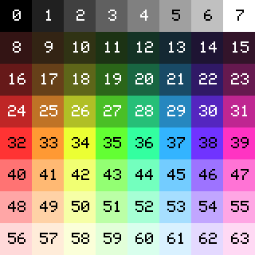

# Raster.js

raster.js is a retro style graphics library, for making pixel art, exploring 2d demo effects, and creative coding.

It aims to serve as a tool for prototyping, experimentation, and learning about how old school graphics worked. It provides precise pixel control, and portability across multiple javascript environments and rendering contexts.

# Features

* Pixel based, hard edges, no anti-aliasing
* Limited palette, default 64 colors, expandable to 256
* Runs in multiple places: in browser, in node.js, on raspberry pi
* Easy utilities for saving gifs and pngs
* Colors presets for machines such as the NES, ZX Spectrum, Pico-8, Gameboy, DOS, and more
* Features that immitate ancient hardware such as color attributes, and rasterization interrupts

# Example Usage

```
const ra = require('raster');
ra.setSize(32, 30);
ra.setZoom(8);

ra.fillColor(19);
ra.setColor(37);
ra.fillCircle({x: 9, y: 16, r: 6});
ra.drawPolygon([[22, 3], [30, 11], [17, 13]]);
ra.setColor(33);
ra.drawRect({x: 4, y: 2, w: 6, h: 10});
ra.fillFlood(22, 8);

ra.show();
```


# Building

You can use raster.js either in the browser using canvas, or on the command-line using node.js (graphics will appear in a new SDL window).

### Browser

Either grab `raster.min.js` from the latest release, or clone this repo and run:

```
npm run build
```

which outputs `dist/raster.min.js`

### Node.js

Building requires SDL2 development libraries. See below for platform specific details. Once you have them properly setup, run

```
npm install raster
```

### SDL2, macos

On macos, run `brew install sdl2` to get SDL2.

### SDL2, Windows

For Windows, only [msys2](https://www.msys2.org/) is currently supported. Go to [this page](https://www.libsdl.org/download-2.0.php) and get `SDL2-devel-2.0.16-mingw.tar.gz`. Extract the `SDL2-2.0.16` folder and place it within the directory `c:/SDL/`, so that it ends up at `c:/SDL/SDL2-2.0.16/`. If you use to use a different location instead of `c:/SDL/`, assign that location to the environment variable `SDL_PATH`.

# Getting started

Using raster.js starts with importing the library, usually naming it simply `ra`.

```
const ra = require('raster');
```

This library gives a number of useful functions.

## Setup

The size of the display (measured in pixels) can be set using the `setSize` method. First comes `x` (the width), then `y` (the height).

```
ra.setSize(32, 30);
```

The display can increase the size of its pixels, as it appears on your physical screen, using the `setZoom` method. Note that this does not change the number of the pixels themselves.

```
ra.setZoom(8);
```

## Drawing pixels

Clearing the display can be done using the `fillColor` method. Raster.js uses a limited color palette, just like many retro computer systems, limited to at most 256 colors. The default palette can be found in the "colors" section below. Functions that require a color parameter, such as `fillColor`, therefore only require a single numerical parameter, which uses that color from the palette.

```
ra.fillColor(12);
```

For other drawing functions, use `setColor` to choose what color to draw with.

```
ra.setColor(37)
```

Then draw some things to the display.

```
ra.fillCircle({x: 9, y: 16, r: 6});
ra.drawPolygon([[22, 3], [30, 11], [17, 13]]);
```

The same color will be using for drawing until it is changed again with `setColor`.

```
ra.setColor(33);
ra.drawRect({x: 4, y: 2, w: 6, h: 10});
ra.fillFlood(22, 8);
```

## Showing it

Once this is complete, and the image is ready for display, use `ra.show` to see it.

```
ra.show();
```

## Animation

For animation, use `ra.run` instead of `ra.show`, and pass a draw function that is used to update the display every frame.

```
function draw() {
  ra.setColor(8+ra.time/2);
  ra.drawLine(0, 0, ra.oscil({max:80}), ra.oscil({max:80,begin:0.5}));
}

ra.run(draw);
```

# Command-line options

When running from a node.js script, you can pass command-line parameters to modify raster.js's behavior.

```
--num-frames [num]
```

The number of frames to display, then quit.

```
--save [output-filename]
```

Save an image (png or gif) instead of using the default display.

```
--display [display]
```

Change the display. See `useDisplay` in the docs for supported displays.

```
--zoom [zoom]
```

Change the zoom level.

```
--colors [colorSet]
```

Use a specific colorSet. See `useColors` in the docs for supported colorSets.

# Colors

The current default colorset for raster.js is the "quick" palette, shown here:



This is likely to change in a future version. Users should either add `ra.useColors('quick')` to their code, or be prepared to update the colors they use once this change happens.

# API

See [the docs](docs.md) for the full documentation of the methods avaiable in raster.js.

# Coming soon

See the [upcoming plans](plan.md) of what's coming in the future.
