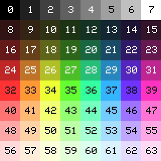

# API

The API should be considered unstable for now, subject to changes until a 1.0 release.

## Setup functions

```
setSize
setZoom
setTitle
setGrid
originAtCenter
useColors
useDisplay
```

### setSize(w, h)

Set the size of the display and standard plane, in pixels.

### setZoom(zoom)

Set the zoom level, in other words, the size of a single pixel as it appears on the physical viewing screen. Not supported by all environments.

### setTitle(title)

If the display is in a window, sets the title of that window. Also used by discovery services to determine the name of a script without running it.

### setGrid(units)

Show the grid on top of the display, spaced out the given number of units.

### originAtCenter()

Move the x,y coordinate system's origin to the center of the plane, instead of the upper-left.

### useColors(colorset)

Assigns the color set to use for displaying the scene. May either be the name of a pre-existing color set, or a list of rgb values.

If not invoked, the current default colorset is this:



This will likely change in the future: call `useColors('quick')` unless you want to modify your scripts in the future.

Names of pre-existing color sets:

`quick`: The current default colorset, shown above. 64 colors, a quick and simple rainbow palette.

`dos`: Colors used by the DOS operating system. TODO: Specify which video standard.

`nes`: Colors used by the NES 8-bit console.

`grey`: A grey scale color set.

`gameboy`: Colors used by the Gameboy handheld console.

`zx-spectrum`: Colors used by the ZX Spectrum 8-bit computer.

`c64`: Colors used by the Commodore 64 8-bit computer.

`pico8`: Colors used by the Pico-8 fantasy console.

### useDisplay(display)

The display to use, instead of the default display. Either the name of a pre-existing display, or a display object.

Names of pre-existing displays:

`ascii`: When running in a terminal, output ascii art to stdout.

## Utility functions

```
loadImage
makePolygon
rotatePolygon
oscil
on
```

### loadImage(filename)

Loads an image, by opening it and reading its contents. Can be passed to `drawImage` once reading has completed.

In some environments, such as node.js, `loadImage` is synchronous, so images are opened and read all at once. However, in order to keep scripts portable, it is recommended to also handle async environments, such as web browsers. To do this, call `loadImage` at the top-level of your script, and then only use `drawImage` inside of a render function that is passed to `show` or `run`. Raster.js guarantees that all images opened will be fully loaded once the render function is invoked, assuming that the images can be loaded without error.

`filename`: the name of the image to load. Either a local filesystem path or a web accessible URL.

`returns` an image, opened but not necessarily loaded

### makePolygon(shape)

Converts a set of a points into a polygon.

`shape`: Either a list of points or a polygon.

`returns` a polygon

### rotatePolygon(shape, angle)

Rotates the given polygon by the given angle, returning a new polygon.

`shape`: Either a list of points or a polygon.

`angle`: Number of radians to rotate.

`returns` a polygon

### oscil({period, begin, max, click})

Produce an oscilating wave value that varies between 0.0 and 1.0 in a sinusoidal motion. Parameters to `oscil` must be named parameters only, positional parameters are not allowed.

`period`: The period of the motion, in clicks. Larger means a slower motion. Default is 60

`begin`: How far into the motion to begin, as a fraction between 0.0 and 1.0. Default is 0.0

`max`: Maximum value to be returned, representing the distance from valley to peak. Default 1.0

`click`: Parameter used as input. Default is `ra.timeClick`

### on(eventName, callback)

Handle events caused by user interaction. Only eventName that is currently handled is `keypress`. Upon each keypress the callback will be invoked information about the event.

## Special variables

```
width
height
time
timeClick
TAU
```

### width, height

Width and height of the scene, equivalent to the display size.

### time

The number of seconds since the scene begin, as a floating point value.

### timeClick

The number of frames that have rendered so far, increasing by 1 per frame.

### TAU

A mathematical constant representing the number of radians in the full rotation of a circle around a plane.

## Color usage

```
fillColor
fillTrueColor
setColor
setTrueColor
```

### fillColor(color)

Set the background color and clear the plane.

### fillTrueColor(rgb)

Add the rgb value to the colorSet and use it as the background color. Also clear the plane.

### setColor(color)

Set the foreground color to use for drawing.

### setTrueColor(rgb)

Add the rgb value to the colorSet and use it as the foreground color.

## Drawing

For most of these methods, there are two versions, one starting with `draw` and another starting with `fill`. The former only renders the outside of a shape, the latter will fill it in.

```
drawLine     -
drawDot      -
drawSquare   fillSquare
drawRect     fillRect
drawCircle   fillCircle
drawPolygon  fillPolygon
drawImage    -
-            fillPattern
-            fillFrame
-            fillFlood
-            fillPattern
```

### drawLine(x0, y0, x1, y1, cc?)

Draw a line from the point x0,y0 to x1,y1.

If any of the values are non-integers, then the line is drawn between those points as though they are floating point values.

`cc`: "connect corners" flag. If all the values are integers, and `cc` is false, then the line is drawn from the center of one point to the center of the other, by off-setting each value by 0.5 to avoid sampling bias. However, if all values are integers and `cc` is a true value, then instead the line is drawn to connect corners between the opposite ends of those points.

### drawDot(x, y)

Draw a dot at point x,y.

### drawSquare(x, y, size)

Draw a square with x,y as the upper-left point, and size being the width and height of the square. The number of pixels spanned, from the left edge of the left-most pixel, to the right edge of the right-most pixel, and from the top of the top-most pixel to the bottom of the bottom-most pixel, is equal to the value of `size`.

### fillSquare(x, y, size)

Fill a square with x,y as the upper-left point, and size being the width and height of the square. Same as `drawSquare`, except the shape's interior is also filled.

### drawRect(x, y, w, h)

<b>&nbsp; drawRect({x0, y0, x1, y1})</b>

Draw a rectangle with x,y as the upper-left point, and w,h as the width and height.

### fillRect(x, y, w, h)

<b>&nbsp; fillRect({x0, y0, x1, y1})</b>

Fill a rectangle with x,y as the upper-left point, and w,h as the width and height. Same as `drawRect`, except the shape's interior is also filled.

### drawCircle(x, y, r, thick?)

<b>&nbsp; drawCircle({centerX, centerY, r, thick?})</b>

Draw a circle with x,y as the upper-left point, and radius of `r`. The circle will be a ring 1 pixel wide, unless `thick` is specified. If it is, the `thick` is measured from the outside edge of the circle and goes inward. The radius is not changed by specifying `thick`.

`r`: radius of the circle. If this is an integer, then the number of pixels from the top or left edge of the top of left pixel to the other extreme will equal `r * 2`, an even number. If `r` is 0.5 more than some integer, the circle will instead span an odd number of pixels from one edge to the other. Other values will be rounded to the nearest half-integer.

### fillCircle(x, y, r)

<b>&nbsp; fillCircle({centerX, centerY, r})</b>

Fill a circle with x,y as the upper-left point, and radius of `r`. Same as `drawCircle`, except the shape's interior is also filled, and `thick` is not used.

### drawPolygon(shape, x?, y?)

Draws the outline of a polygon, offset by the optional x,y position.

`shape`: either a list of points (such as `[[3,4],[5,6],[7,8]]`) or a polygon object as returned by `makePolygon` or `rotatePolygon`.

### fillPolygon(shape, x?, y?)

Fills a polygon, offset by the optional x,y position. Same as `drawPolygon`, except the shape's interior is filled.

### drawImage(img, x?, y?)

Draw an image to the plane, downsampling it to match the allowed colors.

`img`: An image that was created by `loadImage`. NOTE: If raster.js is running in an async environment, such as in a web browser, calls to `drawImage` must be made inside of a render function such as those passed to `then`, `show`, or `run`, while `loadImage` must be called earlier, such as at the script's top-level.

`x`: X dimension (left ) of the upper-left point where drawing starts.

`y`: Y dimension (top) of the upper-left point where drawing starts.

### fillFrame(options, callback)

fillFrame iterates over each pixel of the plane, and invokes the callback with a `mem` representing the frame's data.

`options`: An optional object. Supported fields: `previous` if true, maintain an immutable copy of the previous frame.

`callback`: A callback to be invoked with the frame data. The parameters to this callback may take two forms:

> `function(x, y)`

The callback will be invoked per each pixel in the plane. If the callback returns a number, that number will be assigned to that pixel. Otherwise the pixel's value is not modified.

### fillFlood(x, y)

Fill a region of contiguous color, by replacing it with the current set color. Starts at the given x,y coordinate and floods from there.

### fillPattern(dots)

Fill the entire plane by tiling the pattern represented by the dots parameter. Dots must be a 2-d square array, with each element representing a color.

## Scrolling

```
setScrollX
setScrollY
```

### setScrollX(x)

Scroll the plane x pixels horizontally. Rendering will wrap-around when it reaches the edge of the plane.

### setScrollY(y)

Scroll the plane y pixels vertically. Rendering will wrap-around when it reaches the edge of the plane.

## Palette

```
eyedrop
```

### eyedrop(x, y)

Pick the color at position x,y and return it as a palette entry. If no palette is in use, one is created that directly maps to the colorset.

## Display

```
run
show
save
showFrame
quit
nextFrame
```

### run(renderFunc)

Render the plane to the display. The render function is called once per frame, before the display is updated with the new frame.

### show(renderFunc)

Render the plane to the display once.

### save(filename)

Save the plane to the given filename. May only be run in an environment that supports creating files.

### showFrame(options, callback)

The same as `fillFrame` followed by `show`.

### quit()

Quits the application.

### nextFrame()

Waits one frame.
